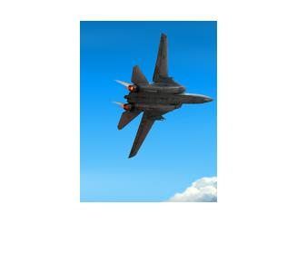

# DSP Lab Project 3: Seam Carving for Content-Aware Image Resizing

## Brief
On the left is the original image with one horizontal and one vertical seam. 
The example on the right shows the result of extending in one dimension and reducing in the other, compared to standard scaling on the bottom right.

## Overview
Seam carving is an algorithm for content-aware image resizing, it was described in the [paper](http://www.win.tue.nl/~wstahw/edu/2IV05/seamcarving.pdf) by S. Avidan & A. Shamir. In contract to stretching, content-aware resizing allows to remove/add pixels which has less meaning while saving more important.

In this programming assignment, we will implement this algorithm and this will involve following tasks:

* Define an energy function that would map a pixel into energy value.
* Define the path of pixels (called seam), which length is width/height of the image.
* Looking for a seam with the minimum energy among all seams(in chosen dimension).
* Find optimal order of deleting seams.
* Reduce an image by a given mask.

<table>
<tr>
<th>seam carving</th>
<th>scaling</th>
<th>cropping</th>
</tr>
<tr>
<td></td>
<td></td>
<td></td>
</tr>
</table>

## Details
For simplification, we will describe only reducing the size of the image. Enlarging process is very similar and described in the last section, and this part is not required but you can implement it by yourself.
### Energy
The idea is to remove content that has smaller meaning for the user (contain less information). We will call this information “energy”. Thus we need to introduce an energy function that would map a pixel into energy value. Here we use gradient of the pixel as an energy function: `e=|dI/dx|+|dI/dy|`.
If the picture has 3 channels, just sum values of the energy for each channel. Edit `energyRGB.m` for doing this part.
### Seam
If we delete pixels with minimum energy but random positions, we will get distorted picture. If we delete columns/rows with minimum energy, we will get artifacts. The solution is to introduce a generalization of column/row (called seam). Formally, let I is n x m image, then a vertical seam is defined as follow: 

where x is a mapping x: [1,..,n] -> [1,..,m]. It means that a vertical seam is path from the top of the picture to the bottom such that the length of the path in pixels is width of the image, and for each seam element `(i,j)`, the next seam element can be only `(i+1, j-1)`, `(i+1, j)`, `(i+1, j+1)`. Similarly, we can define a horizontal seam. Examples of seams are shown on the figure below in black:

We are looking for a seam with the minimum energy among all seams (in chosen dimension): 

. 

The way to find such an optimal seam is by using dynamic programming:

1. Find `M` - minimum energy for all possible seams for each `(i, j)`:
 * fill in the first row by energy
 * for all rows starting from second: `M[i, j] = e[i, j] + min(M[i - 1, j - 1], M[i - 1, j], M[i - 1, j + 1])`;
2. Find the minimum value in the last row of M and traverse back choosing pixels with minimum energy. 

You can follow the hint in `findOptSeam.m` to complete this part. Now we are able to compute seams, and then we need to remove them from the image. Edit `reduceImageByMask.m` to remove pixels by the given input mask.

### Find optimal order of deleting seams
For now, it is already a good tool for reducing image in one dimension - just find and delete seam as many times as you need. But what if you need to reduce the size of the image in both directions? How to decide at every iteration whether it is better (in terms of energy minimization) to delete a column or a row? This problem is solved, again, using dynamic programming. 

Let `n’ x m’` are desirable size of the image `(n’ < n, m’ < m)`. We introduce a transport matrix `T` which defines for every n’ x m’ the cost of the optimal sequence of horizontal and vertical seam removal operations. It is more suitable to introduce `r = n - n’` and `c = m - m’` which defines number of horizontal and vertical removal operations. In addition to `T` we introduce a map of the size `r x c` TBM which specifies for every `T(i, j)` whether we came to this point using horizontal `(0)` or vertical `(1)` seam removal operation. Edit the `findTransportMatrix()` function to complete this part. 

### Enlarging an image
In order to enlarge a picture, we first compute k optimal seams but then, instead of deleting, duplicate the pixels of each seam by averaging them with their left and right neighbors(verticla case).

### Results

<table border=1>
<tr>
<th> Original Image</th>
<th> Seam</th>
<th> Scale</th>
<th> Crop</th>
</tr>
<tr>
<td>

</td>
<td>

</td>
<td>

</td>
<td>

</td>
</tr>

<tr>
<td>

</td>
<td>

</td>
<td>

</td>
<td>

</td>
</tr>
<tr>
<td>

</td>
<td>

</td>
<td>

</td>
<td>

</td>
</tr>

<tr>
<td>

</td>
<td>

</td>
<td>

</td>
<td>

</td>
</tr>

</table>

### Conclusion
As the results show, we can see that Seam carving is the best way to resize the image. Take plane as example, Seam carving keeps the plane and the cloud, which are important oparts in this picture, but corping only keeps the left part, and scaling squeezes the image.

From the church and plane example, we can clearly see that Seam carving keeps theimportant part of the image and removes the unimportant part, while other two ways either squeeze the image or remove the important part. The reason that I think is because when getting the energy function, we caculate its derivation, picking the min means picking the part that has least change. So that line might be something like a background, and removing it still keeps the important part (which has more changes).

## Credits
	This is an assignment for DSP lab modified by Min Sun and TingAn Chien based on K. Lykov's open source example.
